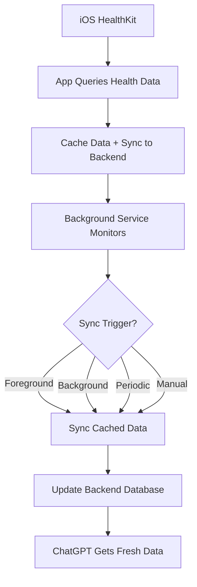

# Background Health Data Sync

## Problem
ChatGPT was receiving outdated health data (e.g., 17 steps instead of 5787 steps) because the iOS app only synced health data when the user opened the app and manually triggered it.

## Solution
Implemented a comprehensive background sync system that automatically keeps health data current for ChatGPT queries.

## Features

### 1. Background App Refresh
- Added `backgroundModes: ["background-app-refresh", "background-fetch"]` to `app.json`
- Enables iOS background processing capabilities

### 2. BackgroundSyncService (`src/services/backgroundSync.ts`)
**Core Features:**
- **Automatic Sync Triggers:**
  - App foreground/background transitions
  - Configurable periodic intervals (15 min - 6 hours)
  - Manual sync on demand
- **Smart Caching:**
  - Caches health data for background use
  - Cache expires after 6 hours to ensure freshness
- **Persistent Configuration:**
  - User preferences stored in AsyncStorage
  - Survives app restarts
- **Rate Limiting:**
  - Minimum 5-minute intervals between syncs
  - Prevents excessive API calls

**Configuration Options:**
```typescript
{
  enabled: boolean;              // Enable/disable background sync
  intervalMinutes: number;       // Sync frequency (15, 30, 60, 120, 240, 360)
  lastSyncTimestamp: number;     // Last successful sync time
  syncOnAppForeground: boolean;  // Sync when app becomes active
  syncOnAppBackground: boolean;  // Sync when app goes to background
}
```

### 3. Health Data Hook Integration (`src/hooks/useHealthData.ts`)
- **Automatic Caching:** Health data is cached for background sync after each query
- **Exposed Functions:**
  - `triggerBackgroundSync()`: Manual sync trigger
  - `getBackgroundSyncStatus()`: Current sync status and configuration

### 4. Settings UI (`src/app/settings.tsx`)
**New Settings Section:**
- **Background Sync Toggle:** Enable/disable automatic sync
- **Sync Interval:** Choose frequency (15 min to 6 hours)
- **Manual Sync:** Trigger immediate sync with status feedback
- **Sync Status:** Shows last sync time and next scheduled sync

**UI Features:**
- Disabled state for interval settings when background sync is off
- Real-time status updates after configuration changes
- Visual feedback with haptics for user interactions

## Sync Triggers

### 1. Foreground Sync
- Triggers when app becomes active (`AppState: 'active'`)
- Ensures fresh data when user opens the app

### 2. Background Sync
- Triggers when app goes to background (`AppState: 'background'`)
- Syncs latest data before app becomes inactive

### 3. Periodic Sync
- Configurable intervals from 15 minutes to 6 hours
- Uses `setInterval` for consistent background operation
- Respects minimum 5-minute rate limiting

### 4. Manual Sync
- User-triggered from Settings screen
- Immediate sync with status feedback
- Bypasses rate limiting for instant updates

## Data Flow



## Implementation Details

### Authentication
- Uses existing Supabase session for API calls
- Gracefully handles authentication failures
- No sync if user is not authenticated

### Error Handling
- Comprehensive logging for debugging
- Graceful fallbacks for network issues
- User feedback for manual sync results

### Performance
- Minimum sync intervals prevent API abuse
- Cache expiration ensures data freshness
- Background processing doesn't impact app performance

## Configuration Examples

### High-Frequency Sync (Power Users)
```typescript
{
  enabled: true,
  intervalMinutes: 15,  // Every 15 minutes
  syncOnAppForeground: true,
  syncOnAppBackground: true
}
```

### Balanced Sync (Default)
```typescript
{
  enabled: true,
  intervalMinutes: 60,  // Every hour
  syncOnAppForeground: true,
  syncOnAppBackground: true
}
```

### Conservative Sync (Battery Conscious)
```typescript
{
  enabled: true,
  intervalMinutes: 240, // Every 4 hours
  syncOnAppForeground: true,
  syncOnAppBackground: false
}
```

## Usage

### For Users
1. Open Settings → Health Data
2. Enable "Background Sync"
3. Choose sync interval (default: 1 hour)
4. Health data will automatically stay current for ChatGPT

### For Developers
```typescript
// Trigger manual sync
await backgroundSyncService.triggerSync('manual');

// Check sync status
const status = await backgroundSyncService.getStatus();

// Update configuration
await backgroundSyncService.updateConfig({
  intervalMinutes: 30
});
```

## Benefits

1. **Always Current Data:** ChatGPT gets fresh health data without manual app opening
2. **User Control:** Configurable sync frequency based on preferences
3. **Battery Efficient:** Smart rate limiting and optional background sync
4. **Seamless Experience:** Automatic operation with manual override options
5. **Reliable Sync:** Multiple trigger mechanisms ensure data freshness

## Technical Notes

- Requires iOS background capabilities to be enabled
- Uses AsyncStorage for persistent configuration
- Integrates with existing Supabase authentication
- Compatible with current health data sync infrastructure
- No changes required to backend APIs
